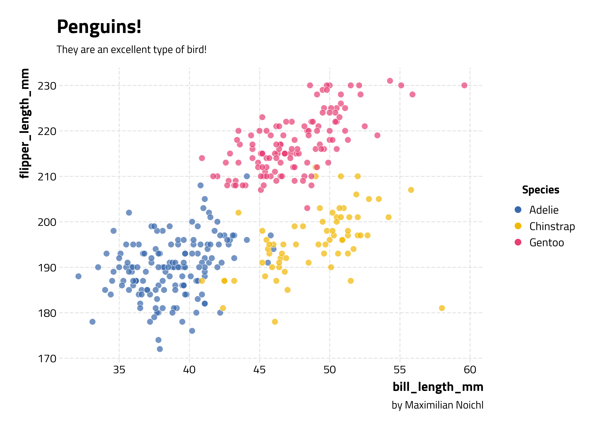
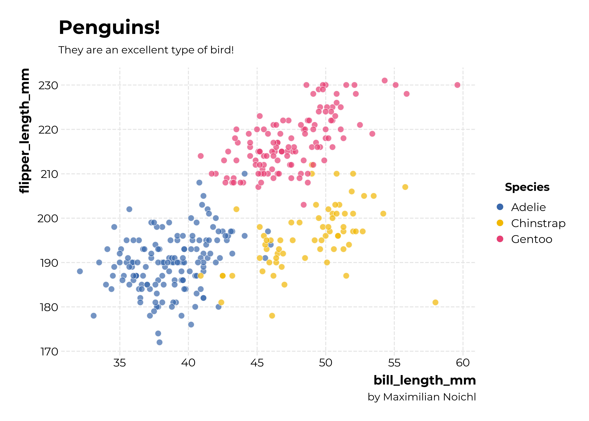
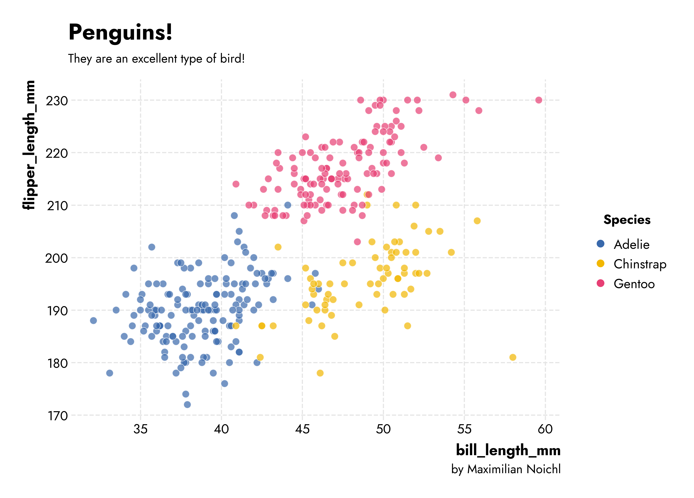
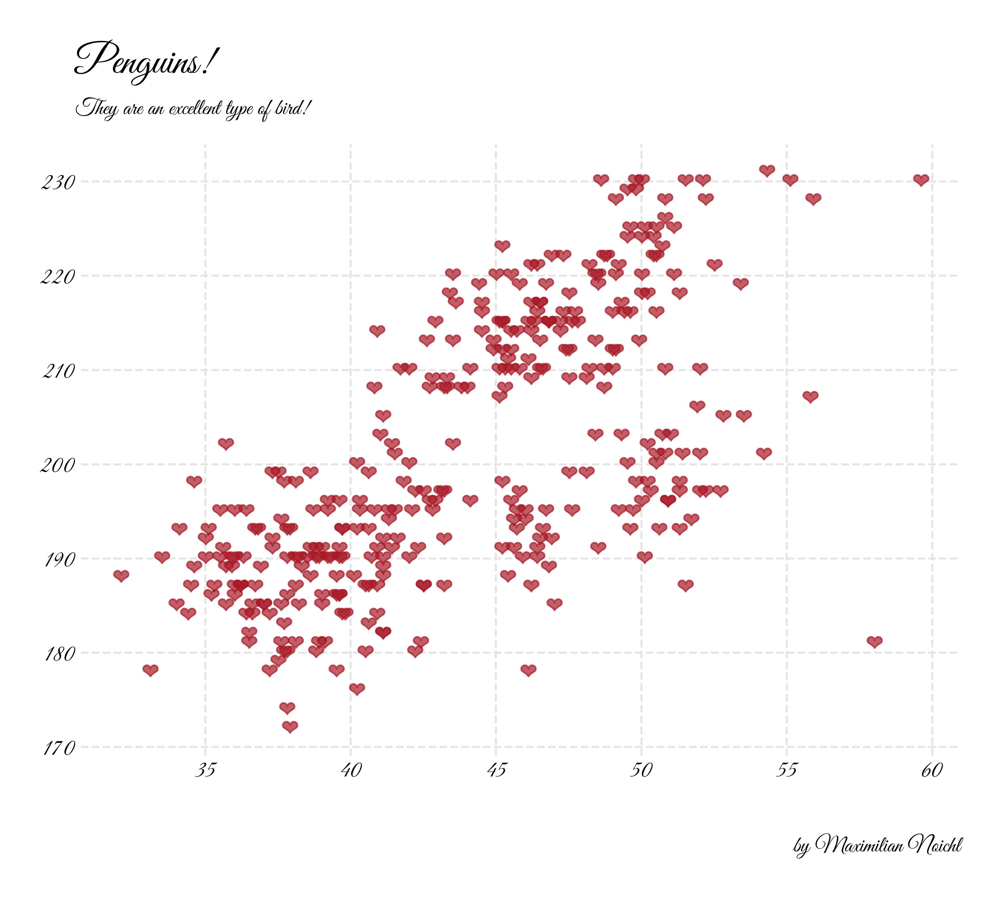

# Opinionated

`opinionated` provides simple, clean stylesheets for plotting with `matplotlib` and `seaborn`.

It's modeled and named after [hrbrthemes](https://github.com/hrbrmstr/hrbrthemes) in R, by Bob Rudis, which are "Opinionated, typographic-centric ggplot2 themes". It's not meant to be an exact clone though, I have made a few different choices. 

The main application I had in mind was to increase the quality of plots in colab-environments, where there is a very small range of preinstalled fonts. The package therefore automatically downloads fonts from GoogleFonts. But I think everything should also work on your local machine. Be aware though, that it's not super well-tested, and might e. g. fail with facets.

## Installation

    pip install opinionated

## Usage
The package is very simple to use, you just import it and set the style you want:

    import opinionated
    import matplotlib.pyplot as plt
    plt.style.use("opinionated_rc")

Then you do your plotting:

    f, ax = plt.subplots(figsize=(10, 7))
    sns.scatterplot(x="bill_length_mm", y="flipper_length_mm", hue='species', data=penguins, s=100, alpha=0.9)

And finally, you can slap on some additional information, using some convenience functions with reasonable defaults. Of course, the usual ways of setting titles, legends, etc. still work.

    opinionated.add_legend(title='Species')
    opinionated.add_attribution('by Maximilian Noichl')
    opinionated.set_title_and_suptitle('Penguins!','They are an excellent type of bird!')

Here's the result:

This certainly does look better than what the defaults would give you, right? –

## Styles

The style `opinionated_rc` that we used above uses the font `Roboto Condensed`, which is my favorite from the original hrbrthemes-package. But there are other styles that you can use. Generally, I would advise using the narrower fonts for plots with more, and the wider ones for fonts with less text. Right now, out of the box we also have available:

`opinionated_sg` which uses Florian Karsten's lovely space `Space Grotesk` font:

    plt.style.use("opinionated_sg")
    

`opinionated_fsc` which uses  `Fira Sans Condensed`. This example also demonstrates that when using faceted plots, it can sometimes be necessary to adjust the title upwards slightly, and the attribution downwards and to the left.

    plt.style.use("opinionated_fsc")

    flights = sns.load_dataset("flights")
    g = sns.relplot(
        data=flights,
        x="month", y="passengers", col="year", hue="year",
        kind="line", palette="crest", linewidth=4, zorder=5,
        col_wrap=3, height=2, aspect=1.5, legend=False,
    )

    for year, ax in g.axes_dict.items():
        ax.text(.8, .85, year, transform=ax.transAxes, fontweight="bold")
        sns.lineplot(
            data=flights, x="month", y="passengers", units="year",
            estimator=None, color=".7", linewidth=1, ax=ax,
        )

    ax.set_xticks(ax.get_xticks()[::2])
    g.set_titles("")
    g.set_axis_labels("", "Passengers")
    g.tight_layout()

    opinionated.add_attribution('by Maximilian Noichl', position = [.97, -0.01])
    opinionated.set_title_and_suptitle('Flights!','More of them with every year!',1.08)

    plt.savefig('img/opinions_fira_sans_condensed_example.png',bbox_inches='tight',
                dpi =400, transparent=False)

`opinionated_tw` which uses `Titillium Web` font, 

`opinionated_m` which uses `Montserrat` font, 

and 

`opinionated_j` which   `Jost`, 

## Additional fonts
You can download whichever font you want from Google Fonts, using the code in the package. So nothing will keep you from doing something like: 

    from opinionated.core import download_googlefont
    download_googlefont('Lobster', add_to_cache=True)
    plt.rc('font', family='Lobster') 

    f, ax = plt.subplots(figsize=(10, 7))
    plt.scatter(penguins["bill_length_mm"],penguins["flipper_length_mm"],  marker="$\u2764$",
                s=100,c='#a81a26',alpha = 0.7)

Which will result in something like the following:

If you want to get an overview of the installed fonts, you can run:

    from opinionated.core import show_installed_fonts
    show_installed_fonts()

## To-Do:

- [ ] Add automatic installation of good colormaps from `cmocean` and `mcrameri`.
- [ ] Make it play nice with facets!

## Inspiration 

https://github.com/dhaitz/mplcyberpunk

https://github.com/hrbrmstr/hrbrthemes
