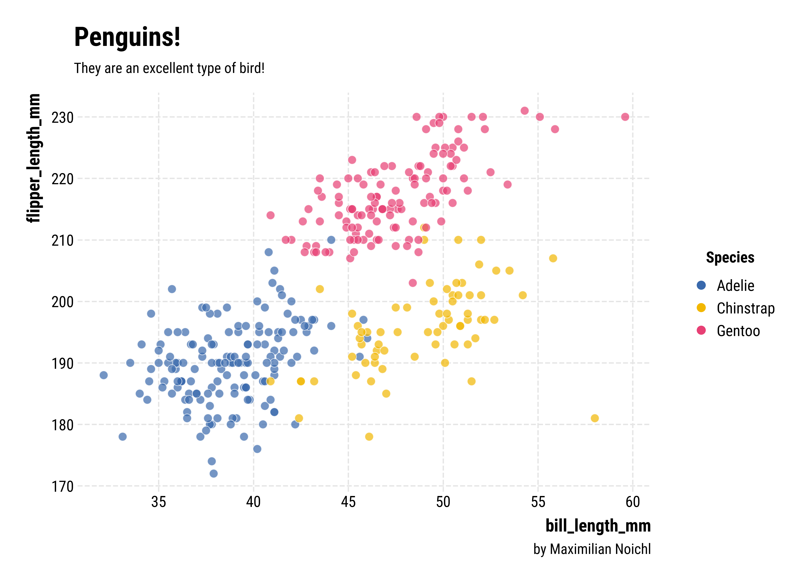
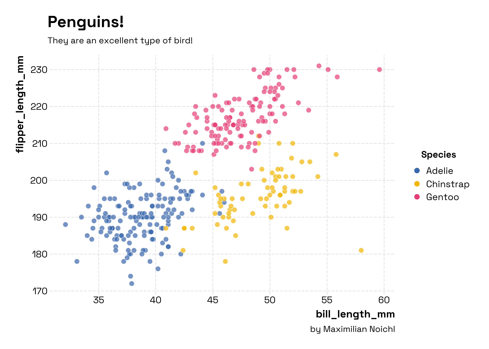
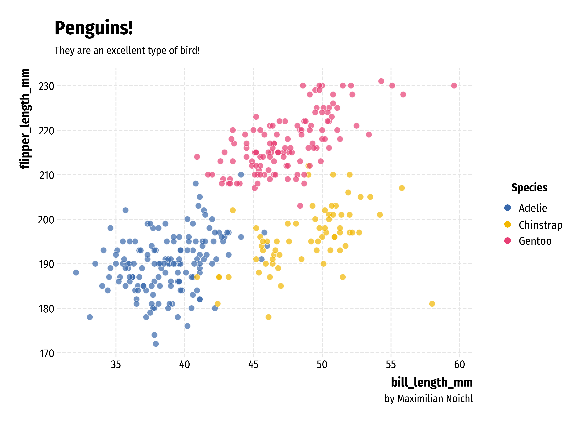

# Opinionated

`opinionated` provides simple, clean stylesheets for plotting with `matplotlib` or `seaborn`.

It's modeled and named after [`hrbrthemes`](https://github.com/hrbrmstr/hrbrthemes) in R, by Bob Rudis, which are "Opinionated, typographic-centric ggplot2 themes". It's not meant to be an exact clone though, I have made a few different choices. The python code takes a lot of inspiration from Dominik Haitz's [`mplcyberpunk`](https://github.com/dhaitz/mplcyberpunk).

The main application I had in mind was to increase the quality of plots in Google-colab-environments, where there is a very small range of preinstalled fonts. The package therefore automatically downloads fonts from GoogleFonts. But I think everything should also work on your local machine. Be aware though, that it's not super well-tested, and might e. g. fail with facets.

## Installation

    pip install opinionated

## Usage
The package is very simple to use, you just import it and set the style you want:

    import opinionated
    import matplotlib.pyplot as plt
    plt.style.use("opinionated_rc")
    import colormaps as cmaps 
    
Note that opinionated automatically installs [`colormaps`](https://pratiman-91.github.io/colormaps/) by Pratiman Patel, which provides an easy interface to some of the best colormap-collections in python, like `cmocean`, `scientific` or  `Cartocolors`, among others. The usual matplotlib colormaps still work, of course!

Then you do your plotting:

    f, ax = plt.subplots(figsize=(10, 7))
    sns.scatterplot(x="bill_length_mm", y="flipper_length_mm", hue="species", data=penguins, alpha=.7, s= 70, palette=cmaps.bold[2:5]._colors)

And finally, you can slap on some additional information, using some convenience functions with reasonable defaults. Of course, the usual ways of setting titles, legends, etc. still work.

    opinionated.add_legend(title='Species')
    opinionated.add_attribution('by Maximilian Noichl')
    opinionated.set_title_and_suptitle('Penguins!','They are an excellent type of bird!')

Here's the result:

This certainly does look better than what the defaults would give you, right? –

## Styles

The style `opinionated_rc` that we used above uses the font `Roboto Condensed`, which is my favorite from the original hrbrthemes-package. But there are other styles that you can use. Generally, I would advise using the narrower fonts for plots with more, and the wider ones for fonts with less text. Right now, out of the box we also have available:

`opinionated_sg` which uses Florian Karsten's lovely space `Space Grotesk` font:

    plt.style.use("opinionated_sg")
    

`opinionated_fsc` which uses  `Fira Sans Condensed`:

`opinionated_tw` which uses `Titillium Web` font, another classic:

`opinionated_m` which uses `Montserrat` font, a relatively wide font to make bold points:

and 

`opinionated_j` which uses `Jost`, a nice geometric font by [indestructible type*](https://github.com/indestructible-type/Jost/tree/master):

## Additional fonts
You can download whichever font you want from Google Fonts, using the code in the package. So nothing will keep you from doing something like: 

    from opinionated.core import download_googlefont
    download_googlefont('Great Vibes', add_to_cache=True)
    plt.rc('font', family='Great Vibes') 

    f, ax = plt.subplots(figsize=(10, 7))
    plt.scatter(penguins["bill_length_mm"],penguins["flipper_length_mm"],  marker="$\u2764$",
                s=100,c='#a81a26',alpha = 0.7)

Which will result in something like the following:

## Checking your installed fonts

If you want to get an overview of the installed fonts, you can run:

    from opinionated.core import show_installed_fonts
    show_installed_fonts()

## To-Do:

- [ ] Make it play nice with facets!
      
## Citation

If you use this software in your work, feel free to cite it using the following metadata:

APA:

    Noichl, M. (2023). Opinionated: Simple, Clean Stylesheets for Plotting with Matplotlib and Seaborn (Version 0.0.2.8) [Computer software]. https://doi.org/10.5281/zenodo.8329780

BibTeX:

    @software{Noichl_Opinionated_Simple_Clean_2023,
    author = {Noichl, Maximilian},
    doi = {10.5281/zenodo.8329780},
    month = aug,
    title = {{Opinionated: Simple, Clean Stylesheets for Plotting with Matplotlib and Seaborn}},
    url = {https://github.com/MNoichl/opinionated},
    version = {0.0.2.8},
    year = {2023}
    }

## Inspiration 

https://github.com/hrbrmstr/hrbrthemes

https://github.com/dhaitz/mplcyberpunk

