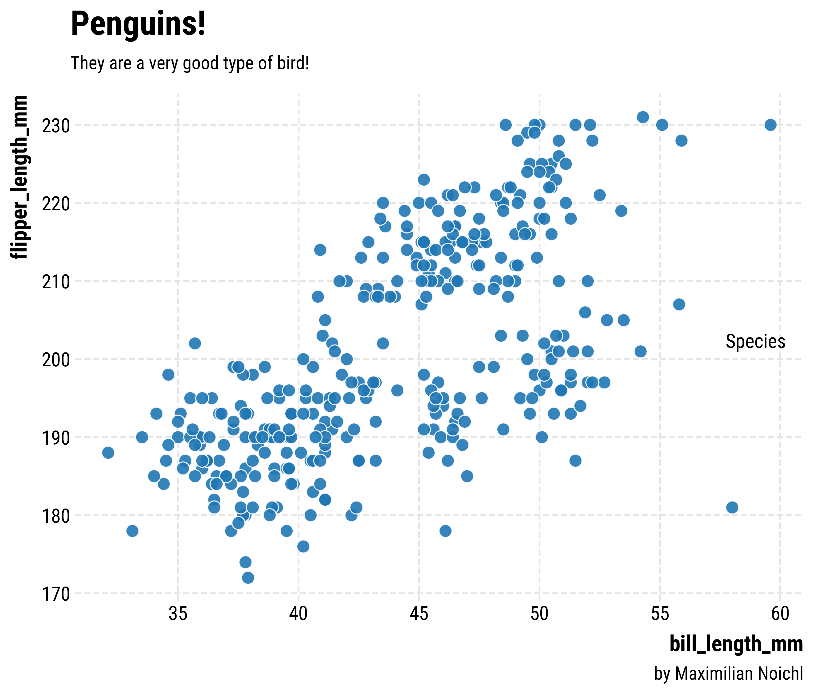

# Opinionated

`opinionated` provides simple, clean stylesheets for plotting with `matplotlib`. 
It's modelled and named after hrbrthemes in R, by hrbrmstr, which are "Opinionated, typographic-centric ggplot2 themes", although I have made some different choices. 

The main application I had in mind was to increase the quality of plots in colab-environments, where there is a very small range of preinstalled fonts. The package therefore automatically downloads fonts from GoogleFonts. But I think everything should also work on your local machine. Be aware though, that it's not super well tested, and might e. g. fail with facets.

## Installation

    pip install git+https://github.com/MNoichl/opinionated.git#egg=opinionated

## Usage
The usage is really simple, you just import the package and set the style you want to use:

    import opinionated
    plt.style.use("opinions_rc")

Then you do your plotting:

    f, ax = plt.subplots(figsize=(10, 7))
    sns.scatterplot(x="bill_length_mm", y="flipper_length_mm", hue='species', data=penguins, s=100, alpha=0.9)

And finally you can slap on some additional information:

    ax.legend(title='Species')
    opinionated.add_attribution('by Maximilian Noichl')
    opinionated.set_title_and_suptitle('Penguins!','They are a very good type of bird!')

Here's the result:

This certainly does look better than what the defaults would give you, right? –

The style `opinions_rc` makes use of the font `Roboto Condensed`, which is my favorite from the original hrbrthemes-package. But there are other styles that you can use. Generally I would advise to use the narrower fonts for plots with more, and the wider ones for fonts with less text. Right now there are also:

`opinions_sg` which uses Florian Karsten's lovely space `Space Grotesk` font, 

`opinions_fsc` which uses  `Fira Sans Grotesk` font, 

`opinions_m` which uses `Montserrat` font, 

and 

``opinions_j` which   `Jost`, 

Importantly, you can download whatever font you want from google-fonts, so nothing will keep you from doing something like: 

    from opinionated.core import download_googlefont
    download_googlefont('Lobster', add_to_cache=True)
    plt.rc('font', family='Lobster') 

Which will result in something like the following:

If you want to get an overview over the installed fonts, you can run the following:

    from opinionated.core import show_installed_fonts
    show_installed_fonts()

## To-Do:

- [ ] Add automatic installation of good colormaps from `cmocean` and `mcrameri`.
- [ ] Make it play nice with facets!

## Inspiration 

https://github.com/dhaitz/mplcyberpunk

https://github.com/hrbrmstr/hrbrthemes
